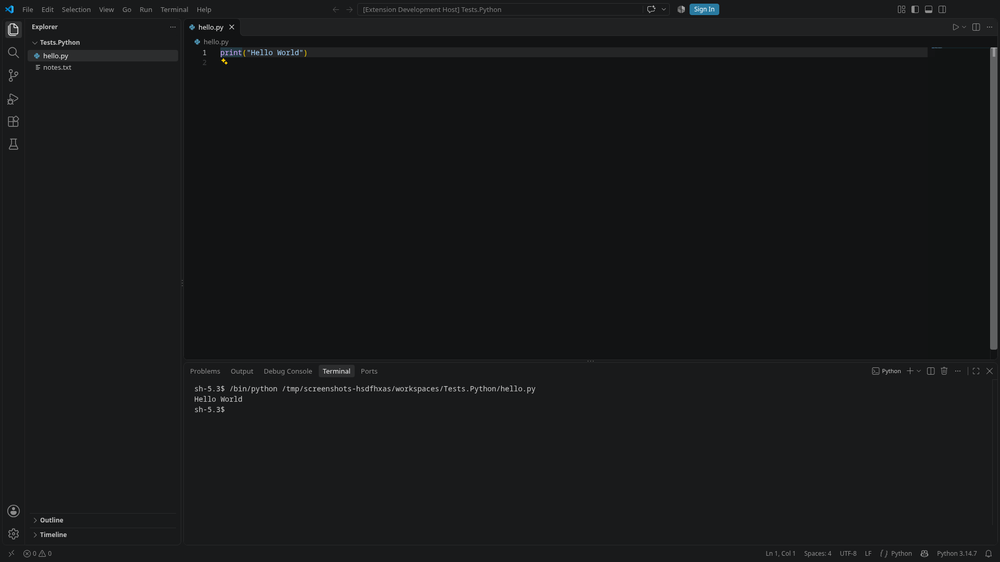

import { Code } from '@astrojs/starlight/components';
import pythonTest from '../../../../../examples/vscode-extension/tests/python.robot?raw';

Many extensions build on others, for example on the Python extension. The extension under test is loaded from source with `extension_development_path`. The extensions it depends on are installed into the isolated VS Code in one of two ways:

- **When VS Code starts:** `Open VS Code` installs the extensions in `extensions` before it starts VS Code. An entry is a Marketplace identifier such as `ms-python.python`, or the path of a `.vsix` file.
- **Into the running VS Code:** `Install VS Code Extension` installs an extension while VS Code runs, for example to test how your extension reacts when another one arrives. VS Code picks it up without a restart.

Both install into the instance's own extensions directory, with VS Code's command-line script, so neither your own VS Code nor other instances get the extension. Extensions that the installed extension declares as dependencies come along: `ms-python.python` brings Pylance, Python Environments and the Python Debugger. Forks of VS Code install from their own gallery; VSCodium, for example, uses Open VSX.

## The example

The example's `python.robot` runs the workspace's `hello.py` with the Python extension, once with the extension installed when VS Code starts and once installed into the running VS Code:

<Code code={pythonTest} lang="robotframework" title="tests/python.robot" />

## Things to know

- **Wait until the extension is ready.** An extension needs a moment to start. Run right after `hello.py` was opened, the Python extension's command failed with "Unable to find workspace for given file". The test therefore waits until the extension shows the chosen interpreter in the status bar. Look for such a sign of readiness in the extensions you depend on.
- **Commands appear a little later.** After `Install VS Code Extension`, the new extension's commands are registered shortly after the install, and a command palette that is already open does not show them. The example's `Run Command` opens a fresh palette until the command is there, see [Writing your own workbench keywords](../workbench-keywords/).
- **Network and time.** Marketplace extensions are downloaded for every VS Code instance; the Python extension with its dependencies is about 100 MB. The example's Python tests are tagged `network`, so `-e network` leaves them out where there is no network access.
- **Interpreters and tools.** The Python extension runs the scripts with an interpreter it finds on the machine. Extensions that need tools, such as a language runtime, need them on the machines where the tests run, including CI.
