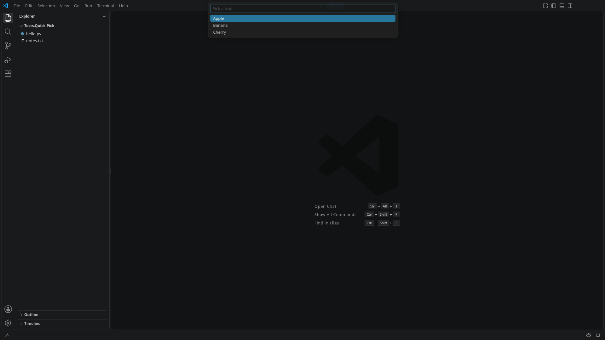
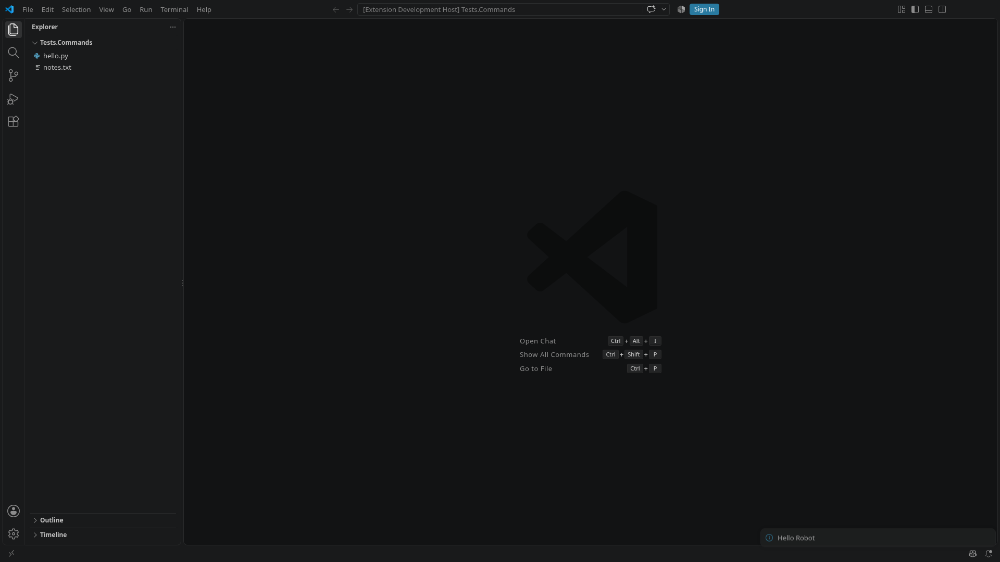
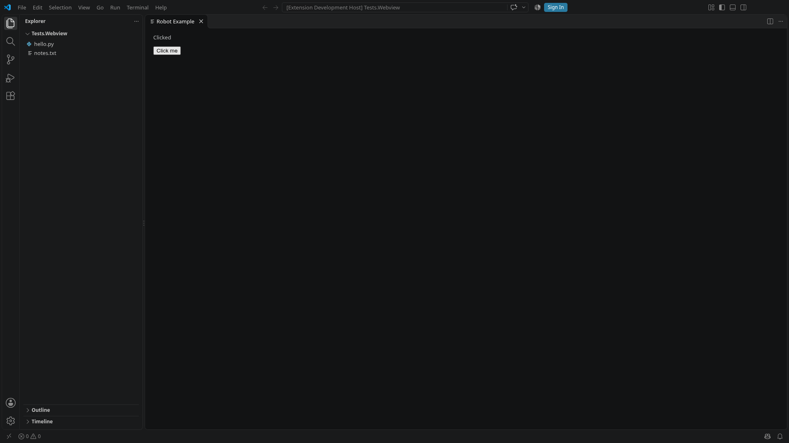
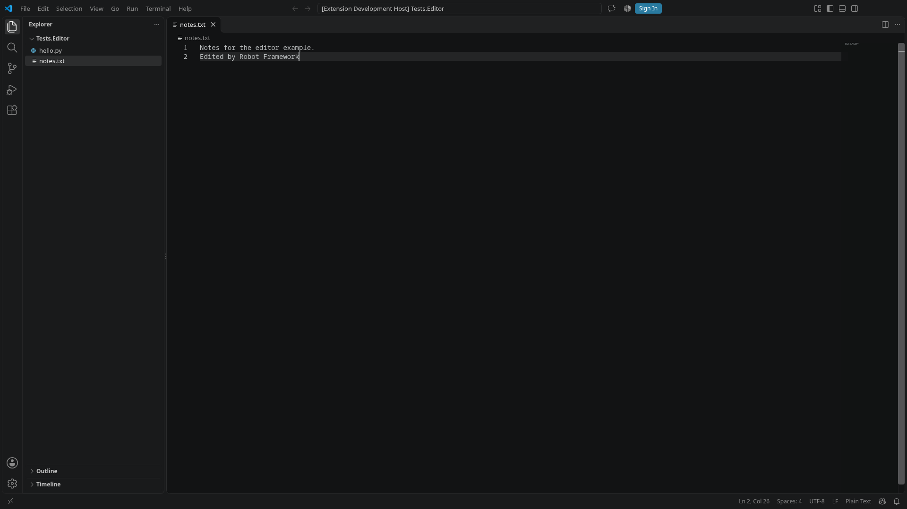
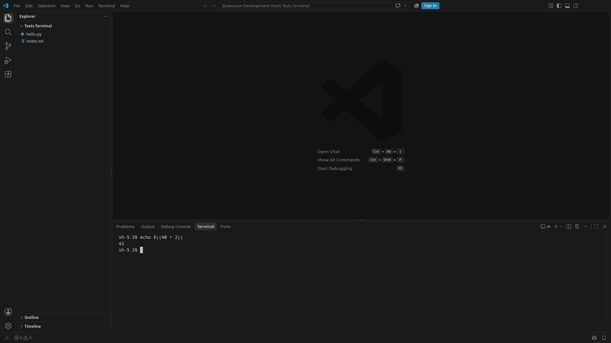

import { Code } from '@astrojs/starlight/components';
import vscodeResource from '../../../../../examples/vscode-extension/tests/resources/vscode.resource?raw';
import commandPalette from '../../../../../examples/vscode-extension/tests/resources/command_palette.resource?raw';
import quickPick from '../../../../../examples/vscode-extension/tests/resources/quick_pick.resource?raw';
import notifications from '../../../../../examples/vscode-extension/tests/resources/notifications.resource?raw';
import webview from '../../../../../examples/vscode-extension/tests/resources/webview.resource?raw';
import editor from '../../../../../examples/vscode-extension/tests/resources/editor.resource?raw';
import fileDialog from '../../../../../examples/vscode-extension/tests/resources/file_dialog.resource?raw';
import terminal from '../../../../../examples/vscode-extension/tests/resources/terminal.resource?raw';
import webviewTest from '../../../../../examples/vscode-extension/tests/webview.robot?raw';

The `VSCode` library downloads VS Code, starts it in isolation and hands the workbench window to Browser. It has no keywords for the command palette, quick picks, notifications, webviews, the editor or the terminal, and no locators for them. These belong to your project:

- The workbench's DOM changes with VS Code releases, and it differs between versions and forks.
- Every extension needs other parts of the workbench.
- When a locator breaks, you fix it in your project right away, without waiting for a release of the library.

The example project `examples/vscode-extension` in the repository shows how to write them. It is a small extension with a command that shows a notification, a command that shows a quick pick, and a command that opens a webview, and a workspace with a Python script and a text file. Its tests keep one resource file per workbench part, with the part's keywords and its locators as variables. The keywords use only Browser keywords. Copy the folder as a starting point and keep the resources your extension needs.

## Opening VS Code

`Open Example VS Code` opens VS Code with the extension of the project's folder, `${EXECDIR}`:

- **Version:** the variables select the VS Code version and default to a download into the user's cache, so a copied project runs without any setup. A personal `.robot.toml` or the command line can point them to an installed VS Code, see [Downloads and cache](../downloads-and-cache/).
- **Workspace:** VS Code opens a fresh copy of `tests/workspace` in the output directory, so tests can change files. `Example Workspace` returns its path, computed when it is needed instead of stored in a suite variable.
- **Settings:** VS Code opens maximised, which fills the screen when a window manager runs, see [CI and the Linux display](../ci-and-display/). VS Code's own file dialog replaces the native one, and the terminal runs `sh`, so that personal shell configuration does not show up in tests and screenshots. VS Code has no built-in profile `sh`, so the settings define it.
- **Options:** named arguments of `Open VS Code`, such as `extensions`, are passed on.

<Code code={vscodeResource} lang="robotframework" title="tests/resources/vscode.resource" />

## Command palette

The command palette filters its list asynchronously while you type. If a test presses Enter right after typing, the palette can still show an older match and run the wrong command. `Run Command` therefore waits for the row of exactly this command before it presses Enter.

- **Exact rows:** a row's `aria-label` is the command's title, or the title followed by `, ` and its key binding or a hint such as `similar commands`. Matching only a part of the label would also find commands such as *Terminal: Create New Terminal (In Active Workspace)*, and Browser's strict mode would fail.
- **Late commands:** some commands are registered only a while after VS Code has started, or after an extension has been installed into the running VS Code, and a palette that is already open does not show them. `Run Command` opens a fresh palette until the command is there. It switches off Browser's failure screenshots for the attempts in between.
- **Templates:** the locator is a template, and `Format String` replaces `{title}` with the command's title. That keeps the whole selector in the variable, so it can be replaced without changing the keyword.

<Code code={commandPalette} lang="robotframework" title="tests/resources/command_palette.resource" />

## Quick picks

A quick pick that an extension shows uses the same list as the command palette, and its rows are matched by their exact label in the same way. `Quick Pick Item Should Be Shown` waits for an item, and `Select Quick Pick Item` waits for it and clicks it.

<Code code={quickPick} lang="robotframework" title="tests/resources/quick_pick.resource" />



## Notifications

Notifications appear asynchronously, and several can be shown at the same time. `Notification Should Be Shown` waits for a toast with exactly the given text.

<Code code={notifications} lang="robotframework" title="tests/resources/notifications.resource" />



## Webviews

A webview is a page inside two nested frames: an outer `iframe.webview` whose `src` names the extension, and an inner `iframe#active-frame` with the extension's HTML. Browser reaches into frames with `>>>`.

`Enter Webview` sets Browser's selector prefix to these frames, so the following keywords act inside the webview with ordinary selectors. It returns the previous prefix, and `Leave Webview` restores it. The prefix travels as a return value and an argument, not as a suite or global variable, and its scope is the test, so a failing test does not leave it set for the next one.

<Code code={webview} lang="robotframework" title="tests/resources/webview.resource" />

A test uses the resources it needs:

<Code code={webviewTest} lang="robotframework" title="tests/webview.robot" />



## Editor

`Open File` opens a file of the workspace through Quick Open, waits for its row, and then for the file's tab to be active. `Save File` saves the active editor. The shortcuts use Playwright's `ControlOrMeta`, which is Ctrl on Linux and Windows and Cmd on macOS. To check what a test typed, read the saved file from the workspace copy, as `editor.robot` does.

<Code code={editor} lang="robotframework" title="tests/resources/editor.resource" />



## File dialog

VS Code normally shows the operating system's file dialogs, which are outside the page and out of Browser's reach. With the setting `files.simpleDialog.enable`, it shows its own dialog in the quick input instead. The dialog lists its folder asynchronously and then sets its input to that folder, so `Open File With Dialog` waits for the listing before it fills in the path, and checks the path before it presses Enter.

<Code code={fileDialog} lang="robotframework" title="tests/resources/file_dialog.resource" />

## Terminal

The terminal's text is in the DOM, in the rows of `.xterm-rows`. `Run In Terminal` opens a new terminal and types a command, and `Terminal Should Show` waits until the active terminal shows a text. The example's test runs `echo $((40 + 2))` and waits for `42`, which proves that the command ran, because the typed command line contains only `40` and `2`.

<Code code={terminal} lang="robotframework" title="tests/resources/terminal.resource" />



## Finding locators

The [RobotCode](https://robotcode.io) REPL runs keywords one by one against a VS Code that stays open, which makes it the quickest way to find locators. Start it in the project's folder:

```sh
robotcode repl
```

Then open VS Code with the project's own keyword and look at the part you need. An aria snapshot lists the roles and names of a part, `Highlight Elements` shows on screen what a selector finds, and `Get Element Count` tells whether it is unique. Assign return values to variables to see them:

```robotframework
Resource    tests/resources/vscode.resource
Resource    tests/resources/command_palette.resource
Open Example VS Code
${snapshot} =    Get Aria Snapshot    .activitybar
Highlight Elements    .activitybar .action-item    duration=3s
${count} =    Get Element Count    .activitybar .action-item
Run Command    Robot Example: Pick
${rows} =    Get Element Count    .quick-input-list .monaco-list-row
```

The aria snapshot of the activity bar, for example, starts like this:

```
- tablist "Active View Switcher":
  - tab "Explorer (Ctrl+Shift+E)" [expanded] [selected]:
  - tab "Search (Ctrl+Shift+F)":
```

VS Code's own developer tools show the full DOM. Open them in the running instance with the command **Developer: Toggle Developer Tools**. Prefer stable class names and attributes such as `aria-label` over positions in the DOM, and move what works into a resource as a variable.

When a new VS Code version needs other locators, override the variables in a profile per version, as described in [VS Code versions and profiles](../vscode-versions/).
